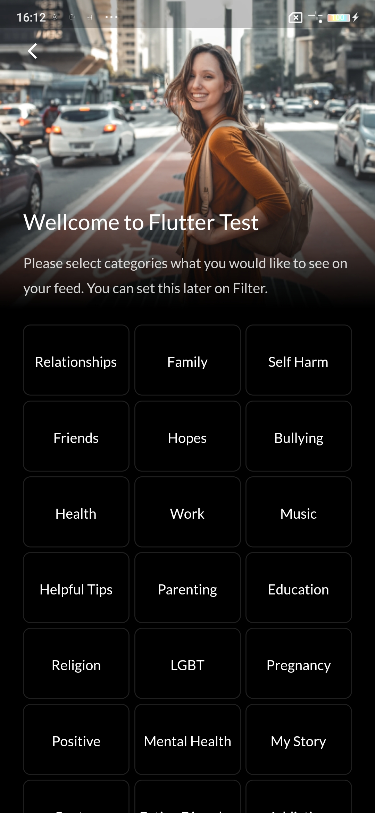
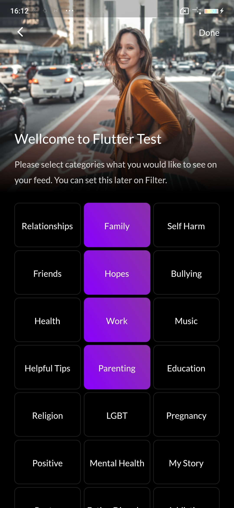

# nexle_testing_round

Nexle Testing Round

## Getting Started
Please run : flutter packages pub run build_runner build
to injection dependencies before run Project

## Images'

Sign up screen - Default

Sign up screen - Too short

Sign up screen - Weak

Sign up screen - Fair

Sign up screen - Good

Sign up screen - Strong

Sign up screen - Validate

Category screen - Default

Category screen - Selected

